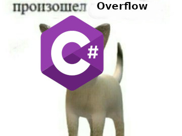

## Разбор КР

Варианты все были достаточно простые, главное не нарушать спецификацию,
какой бы отвратительной она не была...

Во всех разборах я показал 2 варианта обработки переполнения: 
простой и урезанный, умный и аккуратный.


Первый, это просто ограничить ввод.


Второй это использовать оператор checked. Вы просто оборачиваете свой рассчет в checked,
а уже в Main ловите OverflowException.

```c#
void calс()
{
...
    checked 
    {
        // рассчеты
    }
...
}
void Main() 
{
...
    try 
    {
        calc();
    } 
    catch (OverflowException)
    {
        Console.WriteLine("Произолшо переполнение...");
    }
}

``` 

Имейте их ввиду и будьте аккуратны.

Вы большие молодцы!


P.S.
